# **A guide for TransCAD users**

- [**A guide for TransCAD users**](#a-guide-for-transcad-users)
  - [**1. Introduction**](#1-introduction)
  - [**2. View the dataset**](#2-view-the-dataset)
    - [**2.1 Input data**](#21-input-data)
      - [**2.1.1 Input network data for version 9.0**](#211-input-network-data-for-version-90)
        - [**2.1.1.1 Node data**](#2111-node-data)
        - [**2.1.1.2 Link data**](#2112-link-data)
      - [**2.1.2 Input network data for version lower than 9.0**](#212-input-network-data-for-version-lower-than-90)
      - [**2.1.3 Input OD data**](#213-input-od-data)
    - [**2.2 Output data**](#22-output-data)
      - [**2.2.1 Traffic assignment results**](#221-traffic-assignment-results)
      - [**2.2.2 Travel time between OD pairs**](#222-travel-time-between-od-pairs)
      - [**2.2.3 Visualization**](#223-visualization)
  - [**2.3 Modify the dataset**](#23-modify-the-dataset)
    - [**2.3.1 Modify the road attributes**](#231-modify-the-road-attributes)
      - [**2.3.1.1 Modify attributes**](#2311-modify-attributes)
      - [**2.3.1.2 Update the network**](#2312-update-the-network)
    - [**2.3.2 Modify the OD demand multiplier**](#232-modify-the-od-demand-multiplier)
    - [**2.3.3 Modify the BPR parameters**](#233-modify-the-bpr-parameters)
    - [**2.3.4 Modify the turn penalty parameters**](#234-modify-the-turn-penalty-parameters)
    - [**2.3.5 Execute a new traffic assignment**](#235-execute-a-new-traffic-assignment)
  - [**2.4 Notes**](#24-notes)

## **1. Introduction**

This guide is provided for users who are not familiar with the commercial transportation planning software [TransCAD](https://www.caliper.com/tcovu.htm) but wish to get access to the traffic assignment dataset we presented through this software. The software version we used in this guide is 9.0 and the detailed authorization information is shown below.

## **2. View the dataset**

The traffic assignment results of TransCAD are stored in the folder corresponding to each city with a file named **'02 TransCAD results'**. We take the city of **San Francisco** as an example, and here below are all the results obtained from the TransCAD.

Here below is a brief introduction about contents in the TransCAD results folder.

- **cityname.dbd**: The GIS database supported by TransCAD. If your software version is 9.0, then you can directly open it in TransCAD. Detailed steps can refer to [Input network data for version 9.0](#211-input-network-data-for-version-90).

- **cityname_link.shp/cityname_node.shp**: If you have a software version lower than 9.0, then you should import the GIS file into the TransCAD manually based on the given link and node shapefile. Detailed steps can refer to [Input network data for version lower than 9.0](#212-input-network-data-for-version-lower-than-90).
  
- **od.mtx**: The OD demand matrix supported by TransCAD.
- **LinkFlows.bin/LinkFlows.bin.csv**: The traffic assignment results generated by TransCAD.
- **ShortestPaths.mtx/ue_travel_time.csv**: The shortest travel time (min) between TAZs generated by TransCAD after the traffic assignment.

### **2.1 Input data**

Network data (node and link data), as well as OD data are the two main input data for traffic assignment, here we give a brief demonstration about how to view these data in TransCAD respectively.

- Network data: Save as '.dbd' format in TransCAD. Node and link data would be connected according to the node ID and be displayed as layers respectively.
- OD data: Save as '.mtx' format in TransCAD.

#### **2.1.1 Input network data for version 9.0**
First of all, open the software and click the 'Open File' button.

Then, navigate to the storage location of the dataset on your computer, and open the file with the '.dbd' extension. It is a file format used by TransCAD to store the road network geographic information.

Then the visualization of a city’s road network would be displayed in TransCAD as below.

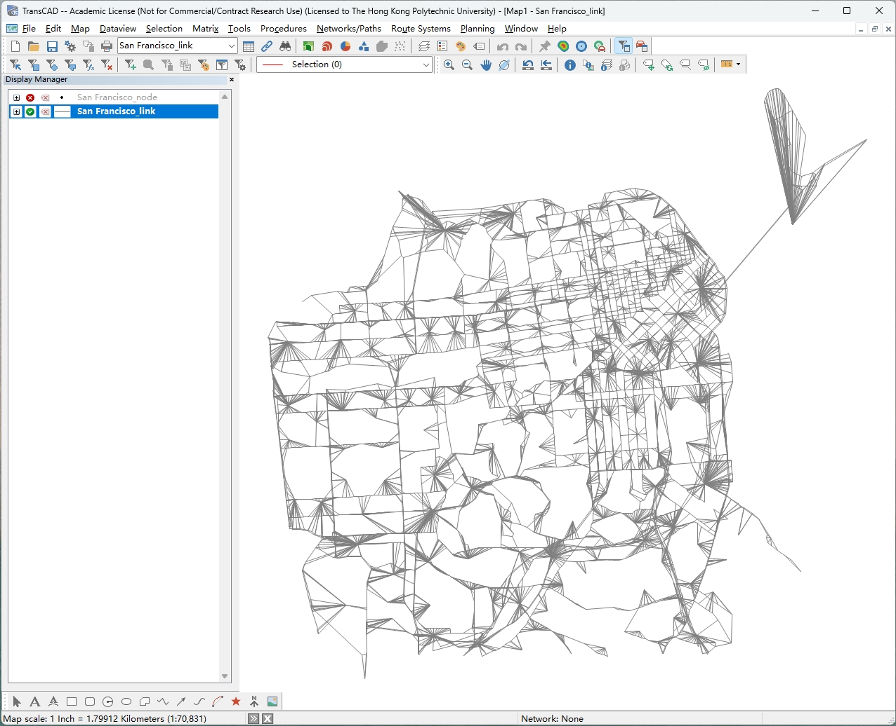

##### **2.1.1.1 Node data**

Open the node layer in the 'Display Manager' box by clicking the green check box and activate it in the working layer box.

Click the 'New Dataview' button and then the node attribute table can be retrieved.

Below is the corresponding node attribute table and each row records a node's information.

As shown in the dataview table above, the fields with a green background are automatically generated by TransCAD when importing the data, while the fields with a light-colored background contain information from the initially imported data. A detailed description of each node filed is provided below.

- ID: ID generated automatically by TransCAD
- Longitude: Longitude generated automatically by TransCAD
- Latitude: Latitude generated automatically by TransCAD
- Elevation: Elevation generated automatically by TransCAD
- Node_ID: Original ID information
- Lon: Original Longitude information
- Lat: Original Latitude information
- Tract_Node: A binary variable indicating whether a node is a Traffic Analysis Zone (TAZ) or not

##### **2.1.1.2 Link data**

Similarly, the link attribute table can be retrieved in the same way.

Here below is the corresponding link attribute table and each row records the information of a link.

Similarly, the fields with a green background are automatically generated by TransCAD when importing the data, while the fields with a light-colored background contain information from the initially imported data. Please note that in TransCAD, a link can be either unidirectional or bidirectional. The fields containing 'AB' or 'BA' indicate the two different directions of each road segment. A detailed description of each link filed is provided below. 

- ID: ID generated automatically by TransCAD
- Dir/direction: A variable indicating whether a link is bidirectional or not (0 for bidirectional while 1 or -1 for one-way)
- Length: Length (km) generated automatically by TransCAD
- Link_ID: Original length ID information
- From_Node_ID: The node ID of the starting point of this link
- To_Node_ID: The node ID of the ending point of this link
- Capacity: The link capacity information (veh/h)
- Free_Speed: The link free flow speed information (km/h)
- Link_Type: Supported link types in osm2gmns (1 for motorway, 2 for trunk, 3 for primary, 4 for secondary, 5 for tertiary)

#### **2.1.2 Input network data for version lower than 9.0**

First, click 'Open File' button in TransCAD and find the file folder location. Identity a '.shp' format and then open the 'San_Francisco_link.shp' file.

Choose the checkbox of 'Also import node Shapefile' and open the corresponding 
'San_Francisco_node.shp' file.

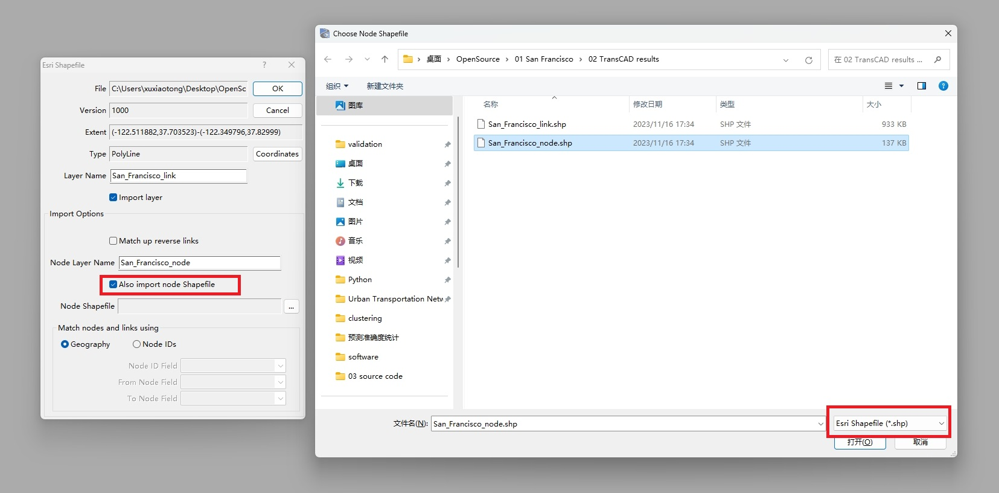

The specific setting for importing the shapefile is shown as below.

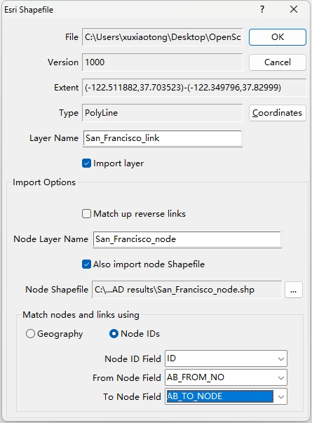

Save the network data as the '.dbd' file in TransCAD.

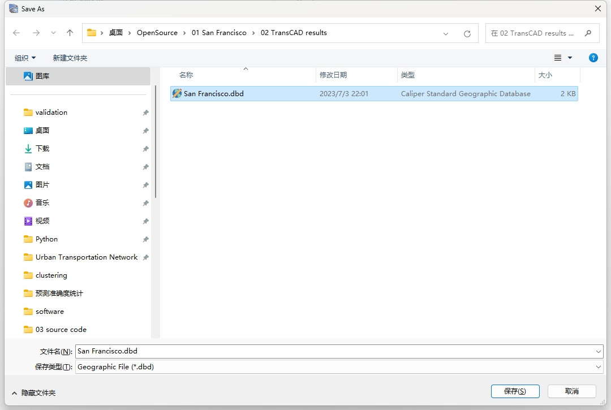

Then, the network file can be displayed, which is similar as the demonstration in the previous section.

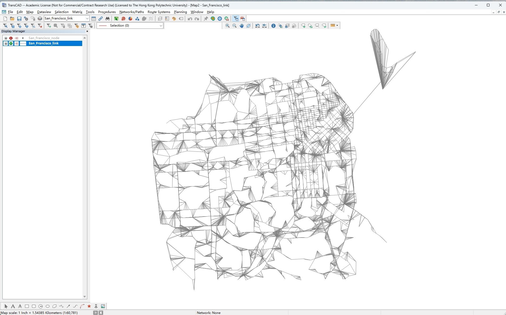

Open the dataview of link layer and copy the attributes of the 'DIR' column.

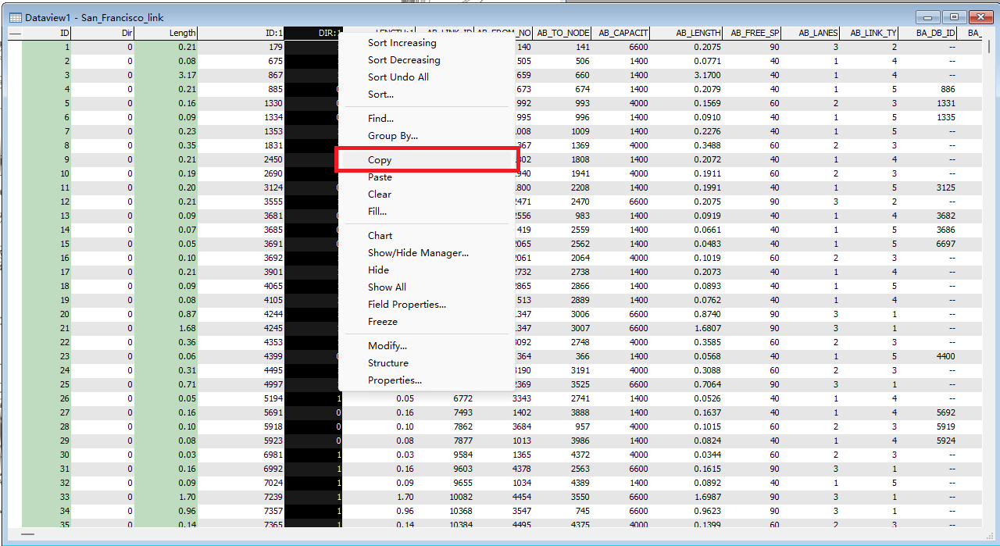

Paste to the 'Dir' column and replace the original values automatically generated by TransCAD.

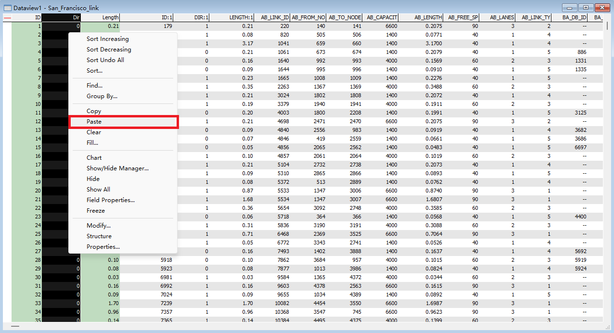

Then a '.dbd' file is generated with the same features as the original provided one in the datasets.

It is worth noting that, due to the transfer process of data format, the exsiting '.dbd' file in the dataset for version 9.0 is not exactly the same as the one created from the shapefile for the lower version in this section. In other words, you need to create a new '.net' file if you want to conduct a new traffic assignmnet, since the provided '.net' file in the dataset is built upon the orginal '.dbd' file. The detailed steps can refer to the corresponding part in [**update the network**](#2312-update-the-network).

#### **2.1.3 Input OD data**

The OD data can be retrieved in the same way. Note that OD matrix tables are stored with a '.mtx' extension in TransCAD.

Here below is the corresponding OD matrix table. The rows or columns record the ID of each Traffic Analysis Zone (TAZ), while each cell represents the corresponding travel demand between TAZs.

### **2.2 Output data**

Output data include traffic assignment results data and travel time between each OD pair.

#### **2.2.1 Traffic assignment results**

Traffic assignment results data are stored in the file called 'LinkFlows.bin', and it can be opened in the same way as described earlier.

Below are the corresponding traffic assignment records for each link after opening the results file.

A detailed description of the assignment results for each link is provided below. 

- ID: ID is generated automatically by TransCAD, which is the same as the link ID in the link layer
- Flow: The final assigned traffic flow (veh/h)
- Tot_Flow: Total traffic flow (veh/h) for both directions
- Time: Loaded travel time (min) for each link
- Max_Time: Maximum loaded travel time (min) for links in both directions
- VOC: Volume to Capacity (V/C) ratio for each link
- Max_VOC: Maximum V/C ratio for links in both directions
- VKmT: Vehicle-Distance Travelled for each link
- Tot_VKmT: Total Vehicle-Distance Travelled for both directions
- VHT: Vehicle-Hours Travelled for each link
- Tot_VHT: Total Vehicle-Hours Travelled for both directions
- Speed: Loaded travel speed (km/h) for each link
- VDF: Loaded cost (result from the Volume Delay Function) for each link
- Max_VDF: Maximum loaded cost for links in both directions

#### **2.2.2 Travel time between OD pairs**

The User Equilibrium (UE) conditions can be satisfied after the traffic assignment and therefore the travel time (using minutes as the unit) between each pair of the OD demand can be calculated based on the travel flow assigned on each link. Here the travel time results are presented as a matrix form which is similar to the OD demand matrix, and the value in each cell represents the shortest travel time between the corresponding origin and destination.

Open the travel time matrix named 'ShortestPath.mtx'.

Below are the detailed contents after opening the travel time (min) matrix.

#### **2.2.3 Visualization**

First of all, we make a selection set to screen out all the connectors by clicking the 'Select by Condition'.

Define the conditions.

Then, all the connectors are selected out and marked with the green line.

Make the connectors invisible by clicking the 'Selection Settings' button.

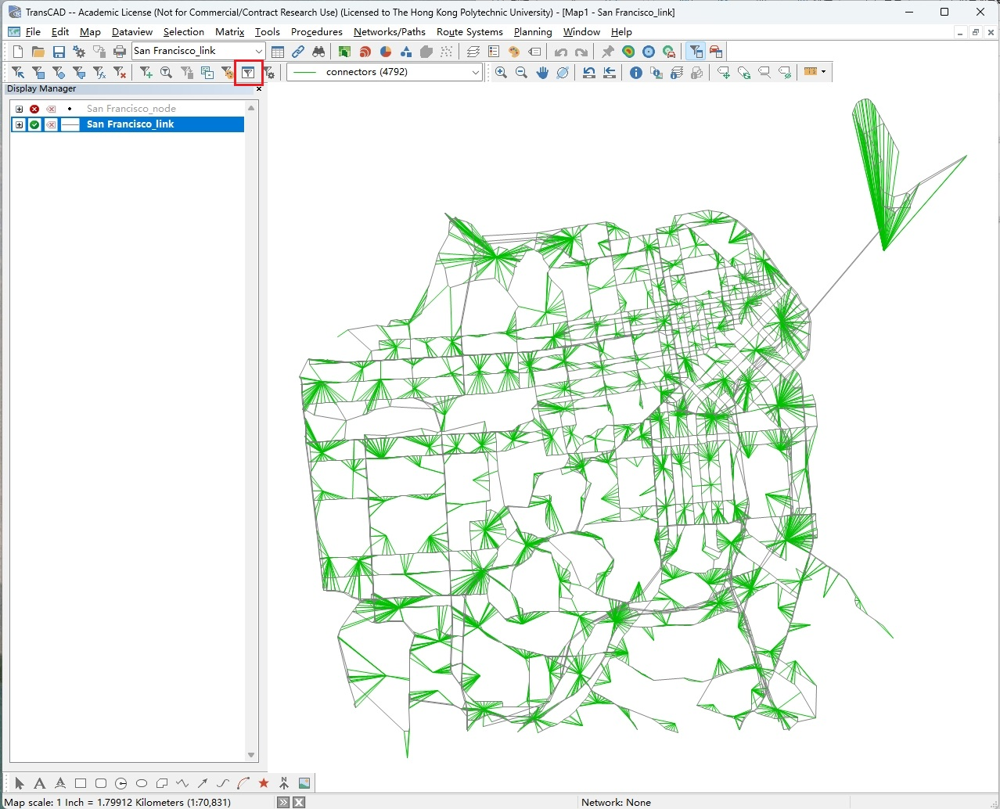

Change the status of the connectors selection set to be invisible.

Open the traffic assignment results table 'LinkFlows.bin' and click the 'Join Dataviews' button.

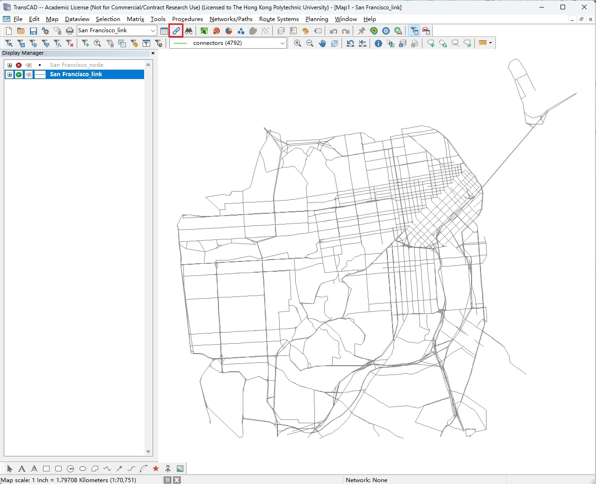

Join the link table ('San Francisco_link') and the traffic assignment results table ('LinkFlows') together based on the common ID field. The specific setting is shown below.

Keep all the tables opened and click the 'Create Flow Map' button as shown below.

Define the visualization setting in the 'Create a Traffic Flow Map' dialog box.

Click OK and then the visualization of the traffic assignment flow can be shown below.

## **2.3 Modify the dataset**

If you want to modify the parameters for traffic assignment according to your own needs and conduct different scenario testing accordingly, this section will briefly explain how to perform these operations.

### **2.3.1 Modify the road attributes**

#### **2.3.1.1 Modify attributes**

If you want to modify the attributes of a specific type of road, you can perform a similar operation as creating the connectors selection set earlier to select roads of that specific type, and then make uniform modifications to the selected set of roads.

For example, define the select conditions for 'expressways'.

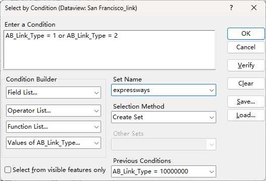

Then all the expressways can be selected and marked with blue lines.

Open the link dataview table and identify the field you want to modify by right-clicking the mouse on the corresponding field. Then click the 'Fill' as shown below to make the modification.

Through this approach, you can assign a uniform value (Single Value option) to a certain type of road or assign values to that type of road based on calculations involving other fields (Formula option).

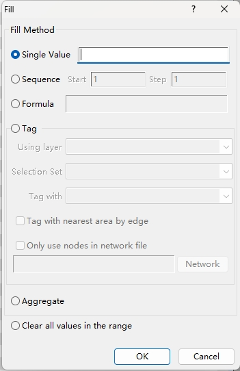

#### **2.3.1.2 Update the network**

After you change the road attributes, you should update the '.net' file, making it according with the '.dbd' file. The '.net' file records the network information and you would be asked to identify it when you conduct the traffic assignment.

To update the '.net' file, you can click 'Create..' button under the 'Network/Paths' option.

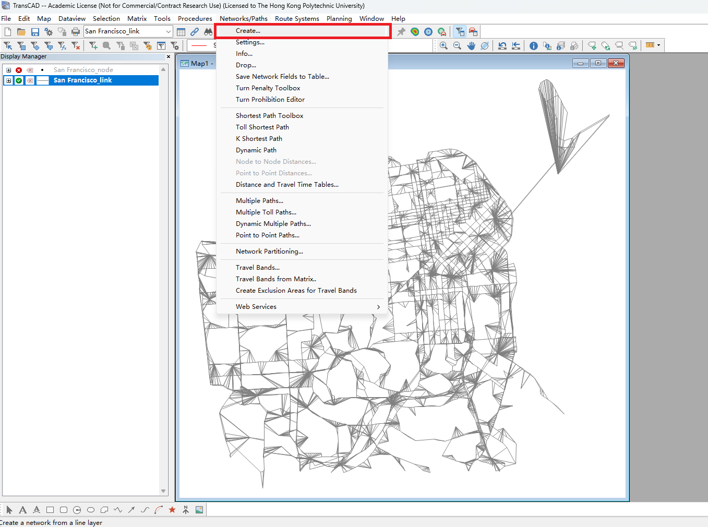

Then click the 'Choose Link Fields' button to select the road attributes you want to update. 

Click the 'Select ALL' button to update all the road attributes.

Then save the updated '.net' file.

### **2.3.2 Modify the OD demand multiplier**

With the OD matrix file open, you can conduct the traffic assignment by clicking the 'Traffic Assignment' button demonstrated below.

You may be asked to specify a road network file with the '.net' extension, which records all road attribute information used for traffic assignment. 

Then, in the popped-up 'Traffic Assignment' dialog box, you can specify an OD demand multiplier by changing the value of the 'Loading Multiplier' text box on the 'Other Options' page.

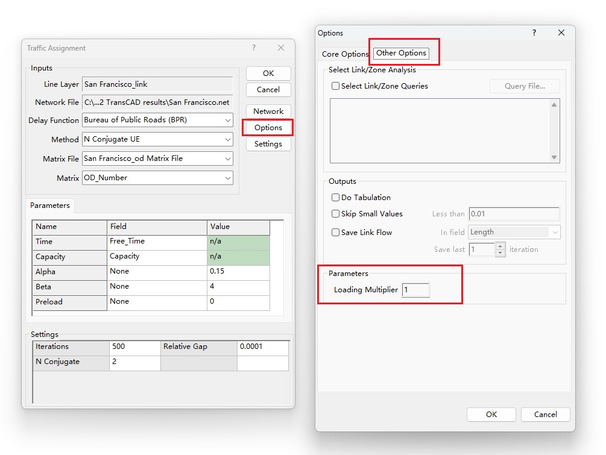

### **2.3.3 Modify the BPR parameters**

In the same popped-up 'Traffic Assignment' dialog box, you can modify the Dealy Function as well as the corresponding parameters.

### **2.3.4 Modify the turn penalty parameters**

Similarly, you can modify the turn penalty parameters by clicking the 'Network' button as shown below. Choose the 'Turn' as the Penalties mode on the 'general' page.

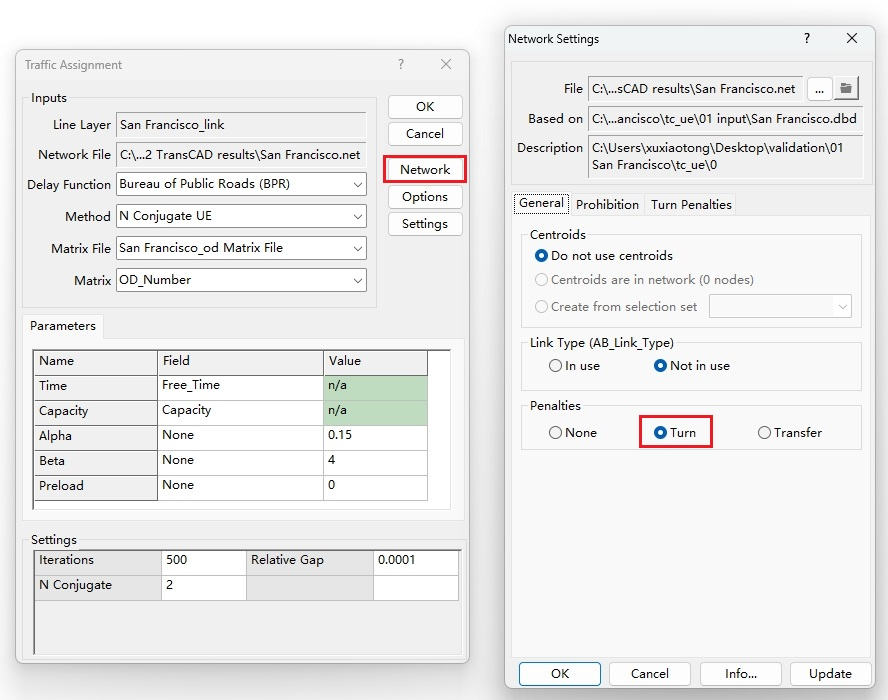

Then, you can specify the detailed turn penalty parameters in the following 'Network Setting' dialog box.

### **2.3.5 Execute a new traffic assignment**

You can then conduct a new traffic assignment and specifying the store location for the final results. The output files include a traffic flow table ('LinkFlows') as described above and a report file containing the iteration information of the optimization algorithm ('IterationLog').

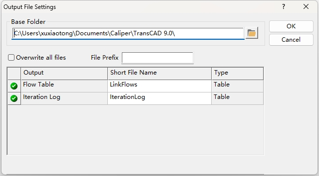

After the traffic assignment, a visual interface of traffic flow will be automatically generated. You can save this interface setting as a project file with the '.map' extension for direct opening in the future.

## **2.4 Notes**

For users who are unable to use the TransCAD software, we have exported the traffic assignment results in the same folder as CSV files to facilitate their usage. Specifically, the file named 'LinkFlows.csv' corresponds to 'LinkFlows.bin' in TransCAD representing the final traffic assignment results, while the file named 'ue_travel_time.csv' corresponds to 'ShortestPaths.mtx' in TransCAD representing the travel time (min) between TAZs.

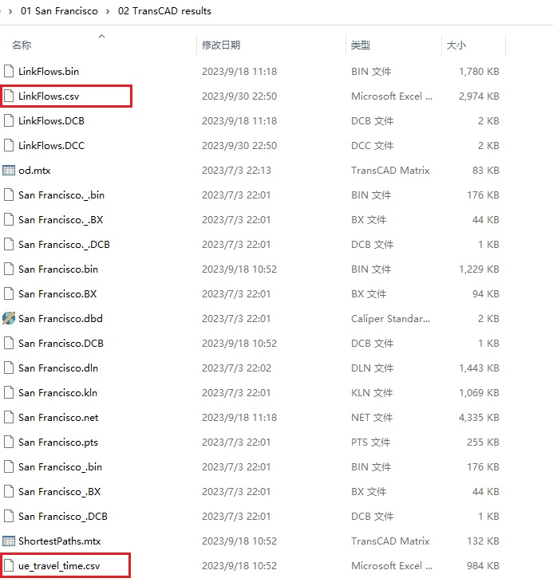
